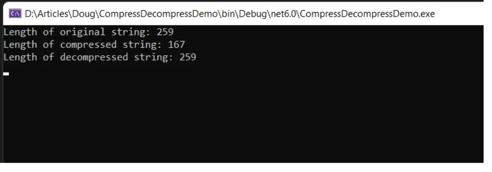
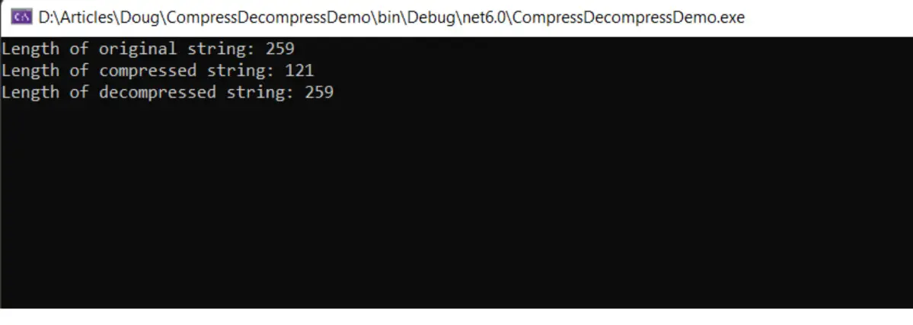
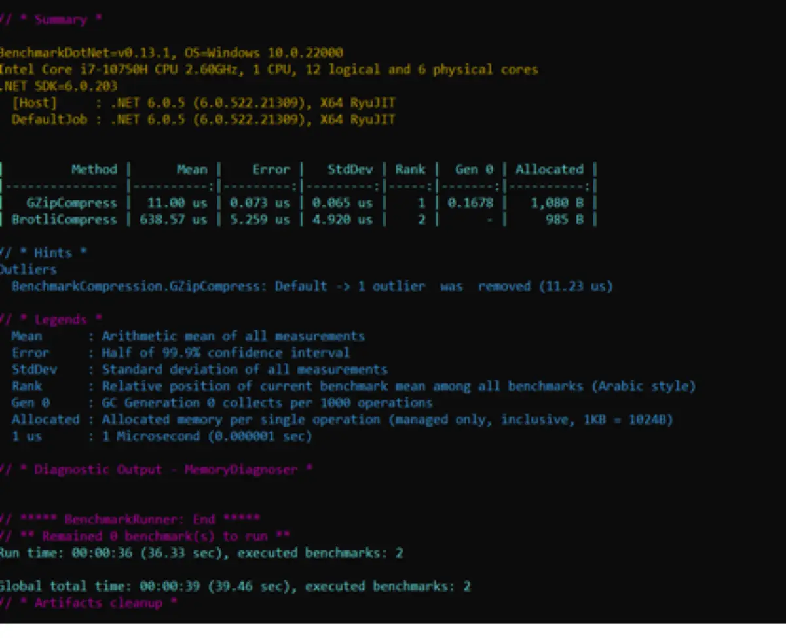

# [Benchmark .NET Core, C# string compression and decompression ](https://www.infoworld.com/article/3660629/how-to-compress-and-decompress-strings-in-c-sharp.html) 
<h3>&nbsp;</h3>

> Build in VStudio. Run the release build for benchmarking.

<h3> Take advantage of the GZip and Brotli compression methods to reduce the size of string data and improve performance in your .NET Core applications.</h3>
<h3>&nbsp;</h3>

<h3> How to compress and decompress strings in C#</h3>
<h3>&nbsp;</h3>

Table Of Contents

- [Benchmark .NET Core, C# string compression and decompression ](#benchmark-net-core-c-string-compression-and-decompression-)
  - [The System.IO.Compression namespace in C#](#the-systemiocompression-namespace-in-c)
  - [Compress and decompress data using GZip in C#](#compress-and-decompress-data-using-gzip-in-c)
  - [Running the GZip compression algorithm](#running-the-gzip-compression-algorithm)
  - [Compress and decompress data using Brotli in C#](#compress-and-decompress-data-using-brotli-in-c)
  - [Asynchronous compression and decompression with GZip and Brotli](#asynchronous-compression-and-decompression-with-gzip-and-brotli)


When developing applications you will often need to deal with strings. And because string objects are costly in terms of performance, you will often want to compress your string content, i.e., the data inside your string objects, to reduce the payload. There are several libraries available to do this but two popular techniques are GZip and Brotli.

In this article we’ll discuss how you can compress and decompress strings using the GZip and Brotli algorithms in C#. To work with the code examples provided here, you should have Visual Studio 2022 installed in your system. If you don’t already have a copy, you can download Visual Studio 2022 here.


We’ll use this project to illustrate string compression and decompression below. But first we’ll install a benchmarking package, BenchmarkDotNet, which will allow us to measure the benefits we gain from compression. 

> Install the BenchmarkDotNet NuGet package
>
> Benchmarking code is essential to understanding the performance of your application. In this article we’ll take advantage of BenchmarkDotNet to track the performance of the methods. If you’re not familiar with BenchmarkDotNet, I suggest reading this article first.
>
> To work with BenchmarkDotNet you must install the BenchmarkDotNet package. You can do this via the NuGet Package Manager inside Visual Studio 2022, or by executing the following command at the terminal (aka cmd):
```
dotnet add package BenchmarkDotNet
```
## The System.IO.Compression namespace in C#
The System.IO.Compression namespace comprises methods to compress files and strings. It contains two compression algorithms: GZip and Brotli. In this sections that follow, we’ll examine how we can compress and decompress string data using both GZip and Brotli compression algorithms in C#.

We’ll use the following text in the examples below:
```c#

string originalString = "To work with BenchmarkDotNet you must install the BenchmarkDotNet package. " +

"You can do this either via the NuGet Package Manager inside the Visual Studio IDE, " +

"or by executing the Install-Package BenchmarkDotNet command at the NuGet Package Manager Console";

```
## Compress and decompress data using GZip in C#

The following code snippet shows how you can compress data using the GZipStream class in C#. Note that the parameter to the Compress method is a byte array.
```c#
public static byte[] Compress(byte[] bytes)
        {
            using (var memoryStream = new MemoryStream())
            {
                using (var gzipStream = new GZipStream(memoryStream, CompressionLevel.Optimal))
                {
                    gzipStream.Write(bytes, 0, bytes.Length);
                }
                return memoryStream.ToArray();
            }
        }
```        
To decompress data that has been compressed using the GZip algorithm, we can use the following method.
```c#
public static byte[] Decompress(byte[] bytes)
        {
            using (var memoryStream = new MemoryStream(bytes))
            {

                using (var outputStream = new MemoryStream())
                {
                    using (var decompressStream = new GZipStream(memoryStream, CompressionMode.Decompress))
                    {
                        decompressStream.CopyTo(outputStream);
                    }
                    return outputStream.ToArray();
                }
            }
        }
```
## Running the GZip compression algorithm
You can use the following code snippet to execute the GZip compression methods we just created.
```c#
byte[] dataToCompress = Encoding.UTF8.GetBytes(originalString);
byte[] compressedData = GZipCompressor.Compress(dataToCompress);
string compressedString = Encoding.UTF8.GetString(compressedData);
Console.WriteLine("Length of compressed string: " + compressedString.Length);
byte[] decompressedData = GZipCompressor.Decompress(compressedData);
string deCompressedString = Encoding.UTF8.GetString(decompressedData);
Console.WriteLine("Length of decompressed string: " + deCompressedString.Length);
```
When you run the above code, you’ll see the following output in the console window.


Figure 1. GZip compressed the original string of 259 characters into 167 characters.

Note that GZip trimmed 92 characters from the original string of 259 characters. Because the original string and the decompressed string should be identical, their lengths should also be the same.

## Compress and decompress data using Brotli in C#
The following code snippet illustrates how you can compress data using the BrotliStream class in C#. As in the GZip example above, note that the parameter to the Compress method is a byte array.
```c#
public static byte[] Compress(byte[] bytes)
        {
            using (var memoryStream = new MemoryStream())
            {
                using (var brotliStream = new BrotliStream(memoryStream, CompressionLevel.Optimal))
                {
                    brotliStream.Write(bytes, 0, bytes.Length);
                }
                return memoryStream.ToArray();
            }
        }
```
And here is how you can use BrotliStream to decompress the data:
```c#
public static byte[] Decompress(byte[] bytes)
        {
            using (var memoryStream = new MemoryStream(bytes))
            {
                using (var outputStream = new MemoryStream())
                {
                    using (var decompressStream = new BrotliStream(memoryStream, CompressionMode.Decompress))
                    {
                        decompressStream.CopyTo(outputStream);
                    }
                    return outputStream.ToArray();
                }
            }
        }
```
Running the Brotli compression algorithm
The following code snippet shows how you can compress a string using the Brotli compression method we created above.
```c#
Console.WriteLine("Length of original string: " + originalString.Length);
byte[] dataToCompress = Encoding.UTF8.GetBytes(originalString);
byte[] compressedData = BrotliCompressor.Compress(dataToCompress);
string compressedString = Convert.ToBase64String(compressedData);
Console.WriteLine("Length of compressed string: " + compressedString.Length);
byte[] decompressedData = BrotliCompressor.Decompress(compressedData);
string deCompressedString = Convert.ToBase64String(decompressedData);
Console.WriteLine("Length of decompressed string: " + deCompressedString.Length);
```
When you run the program, you will see the following output in the console window.


Figure 2. Brotli compressed the original string of 259 characters into 121 characters.

As you can see, Brotli does a much better job of compression than GZip. However, the compression ratio isn’t the whole story, as we’ll see below.

## Asynchronous compression and decompression with GZip and Brotli

Note that there are asynchronous counterparts to the compression and decompression methods we used earlier. Here are the asynchronous versions of the Compress and Decompress methods using the GZip algorithm:
```c#
public async static Task<byte[]> CompressAsync(byte[] bytes)
        {
            using (var memoryStream = new MemoryStream())
            {
                using (var gzipStream = new GZipStream(memoryStream, CompressionLevel.Optimal))
                {
                    await gzipStream.WriteAsync(bytes, 0, bytes.Length);
                }
                return memoryStream.ToArray();
            }
        }
public async static Task<byte[]> DecompressAsync(byte[] bytes)
        {
            using (var memoryStream = new MemoryStream(bytes))
            {
                using (var outputStream = new MemoryStream())
                {
                    using (var decompressStream = new GZipStream(memoryStream, CompressionMode.Decompress))
                    {
                        await decompressStream.CopyToAsync(outputStream);
                    }
                    return outputStream.ToArray();
                }
            }
        }
```
And here are the asynchronous versions of the Compress and Decompress methods using Brotli:
```c#
public static async Task<byte[]> CompressAsync(byte[] bytes)
        {
            using (var memoryStream = new MemoryStream())
            {
                using (var brotliStream = new BrotliStream(memoryStream, CompressionLevel.Optimal))
                {
                    await brotliStream.WriteAsync(bytes, 0, bytes.Length);
                }
                return memoryStream.ToArray();
            }
        }
public static async Task<byte[]> DecompressAsync(byte[] bytes)
        {
            using (var memoryStream = new MemoryStream(bytes))
            {
                using (var outputStream = new MemoryStream())
                {
                    using (var brotliStream = new BrotliStream(memoryStream, CompressionMode.Decompress))
                    {
                        await brotliStream.CopyToAsync(outputStream);
                    }
                    return outputStream.ToArray();
                }
            }
        }
```        
Benchmarking compression and decompression with GZip and Brotli in C#
In the console application project we created earlier, create a new file named BenchmarkCompression.cs and enter the following code.
```c#
[MemoryDiagnoser]
[Orderer(BenchmarkDotNet.Order.SummaryOrderPolicy.FastestToSlowest)]
[RankColumn]
public class BenchmarkCompression
    {
        string originalString = "To work with BenchmarkDotNet you must install the BenchmarkDotNet package. " +
            "You can do this either via the NuGet Package Manager inside the Visual Studio 2019 IDE, " +
            "or by executing the Install-Package BenchmarkDotNet command at the NuGet Package Manager Console";

        [Benchmark]
        public void GZipCompress()
        {
            byte[] dataToCompress = Encoding.UTF8.GetBytes(originalString);
            var compressedData = GZipCompressor.Compress(dataToCompress);
        }

        [Benchmark]
        public void BrotliCompress()
        {
            byte[] dataToCompress = Encoding.UTF8.GetBytes(originalString);
            var compressedData = BrotliCompressor.Compress(dataToCompress); 
        }
    }
```    
When you run the benchmarks, you should see console output similar to that shown in Figure 3 below.



Figure 3. The results from BenchmarkDotNet... GZip wins!

Clearly, compression ratio isn’t the only consideration when choosing a compression algorithm. Although, compared to GZip, you can achieve much better compression using Brotli, the additional compression comes at the cost of performance. GZip is significantly faster than Brotli at compressing and decompressing data.

When benchmarking your .NET application, you should always ensure that you run your project in release mode. The reason is that the compiler optimizes the code differently for debug and release modes. I’ll have more to say about benchmarking and application performance in future posts here.

---
Joydip Kanjilal is a Microsoft MVP in ASP.Net, as well as a speaker and author of several books and articles. He has more than 20 years of experience in IT including more than 16 years in Microsoft .Net and related technologies.

> Copyright © 2022 IDG Communications, Inc.
